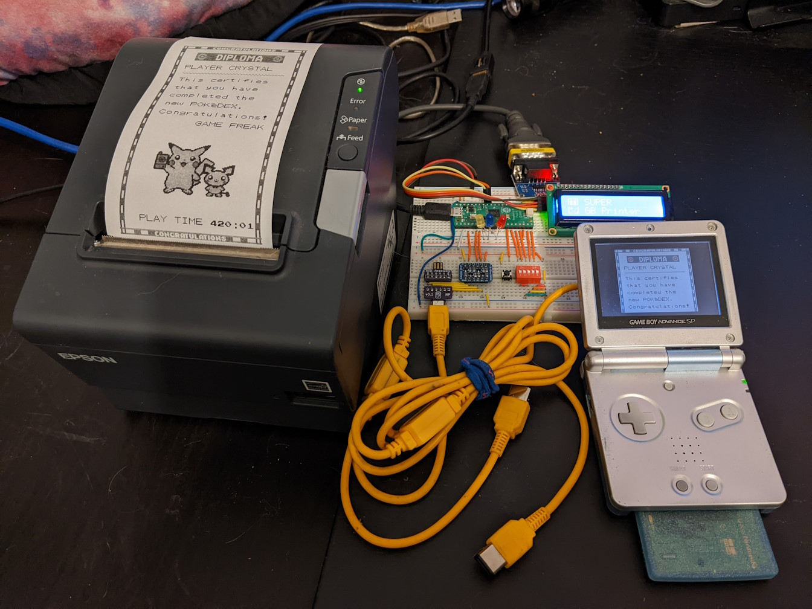

# super-gb-printer
A Game Boy to Epson POS printer interface using a Raspberry Pi Pico and 
written in Micropython. Inspired by the [gbpxl](https://github.com/xx0x/gbpxl)
project and its [multi-tone fork](https://github.com/cristofercruz/gbpxl). 

## Features
- Prints at 1x, 2x, or 3x scale in four color grayscale
- Prints 2 pages at a time to reduce seams between pages
- Settings controlled by DIP switches
- Optional status display using a 1602 LCD screen and LEDs

## Needed Hardware
- Raspberry Pi Pico (Pico 2 is untested but may work)
- Epson TM-T88V with serial port (Newer models such as the T88VI and T88VII
  should also work)
- [4 channel bi-directional level shifter](https://www.aliexpress.us/item/3256804373982286.htm)
  ([Alternative link](https://www.adafruit.com/product/757))
- [RS232 to TTL serial converter](https://www.aliexpress.us/item/3256807353614761.html)
- 9 pin to 25 pin serial cable
- Game Boy link cable
- [Breakout board](https://github.com/Palmr/gb-link-cable) or 
  [link port](https://www.aliexpress.us/item/2255800855891348.html) for the 
  link cable (or cut the end off your cable)
- [1602 I2C LCD screen](https://fluxworkshop.com/products/lbaa100052-16x2-blue-lcd-inc-adapter-keyestudio) (Optional)
- LEDs (optional)
- 5 pin DIP switch

## Default Pinout
Pinout can be customeized by editing the file pinout.py.

| Description                 | Default Pin(s) |
|:----------------------------|:---------------|
| Game Boy CLK *              |              2 |
| Game Boy SI *               |              4 |
| Game Boy SO *               |              5 |
| GB Link Enabled LED         |              6 |
| GB Data RX LED              |              7 |
| Printer UART Activity LED   |              7 |
| DIP Switches                |          11-15 |
| Printer UART TX             |             16 |
| Printer UART RX             |             17 |
| LCD SDA                     |             26 |
| LCD SCL                     |             27 |

## DIP Switch Settings

| Switch | Setting            | OFF               | ON                 |
|:-------|:-------------------|:------------------|:-------------------|
| 1      | Scale amount       | 3x scale          | 2x scale           |
| 2      | Scale amount       | Switch 1 setting  | 1x scale           |
| 3      | Bottom Margin      | Do not add margin | Add margin         |
| 4      | Unused             | --                | --                 |
| 5      | Unused             | --                | --                 |

## Build Information
The Micropython build you use on the Pico must include the 
[ulab library](https://github.com/v923z/micropython-ulab). Pre-built binaries 
for the Pico and Pico W are available 
[here](https://github.com/v923z/micropython-builder/).

Diagrams coming Soon™, the image above and these notes may suffice for now:
- Connect the HV of the level shifter to VSYS on the Pico instead of the
  Game Boy. (LV of course will be 3V3 from the Pico.)
- DIP switches are active high and should be connected to 3V3 on the Pico.
- Pins connected to the Game Boy must go through the level shifter or you may
  damage the Pico!
